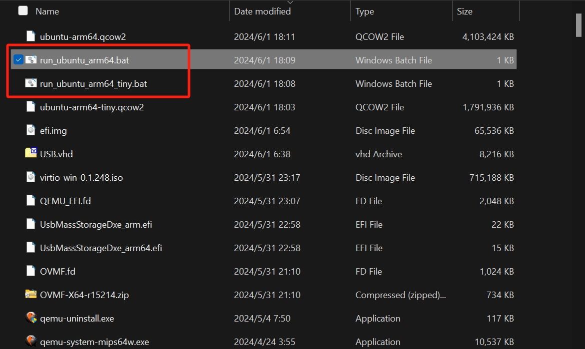
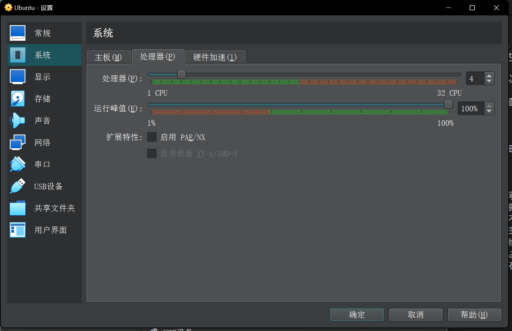
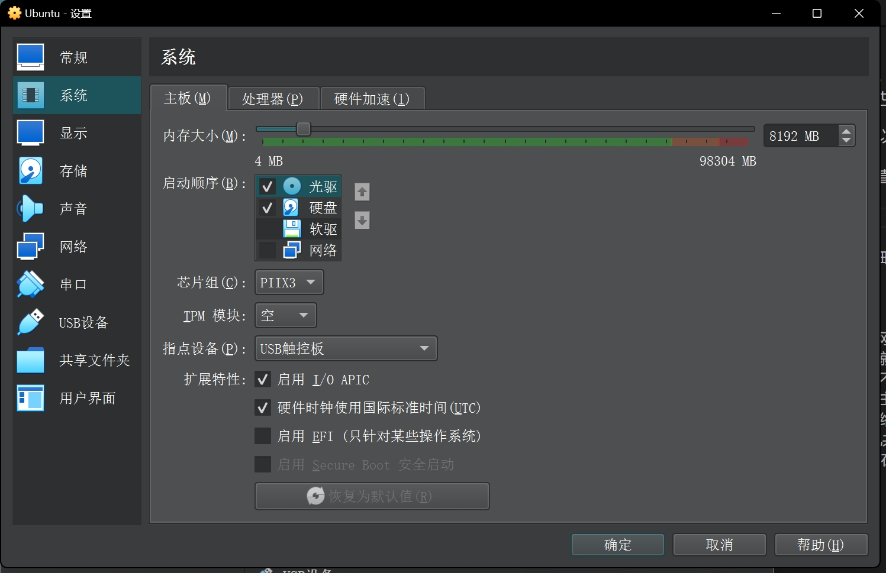
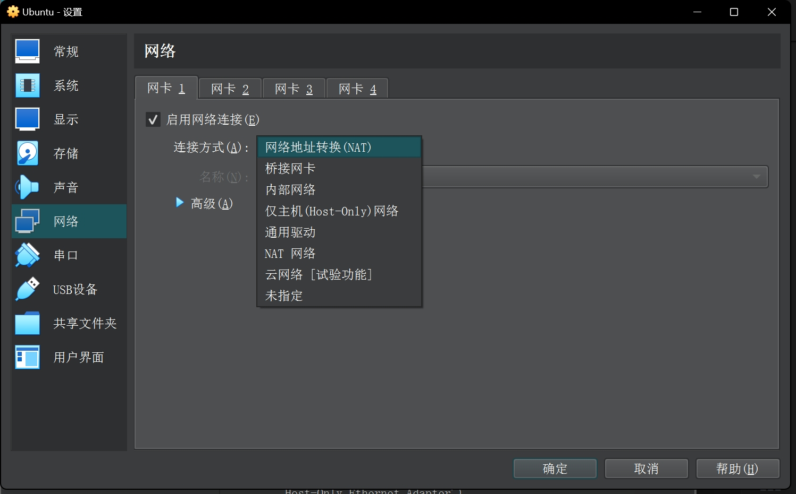
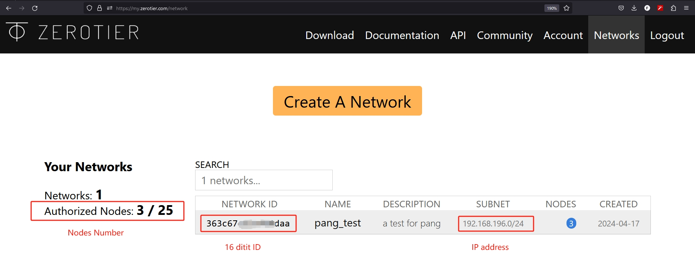
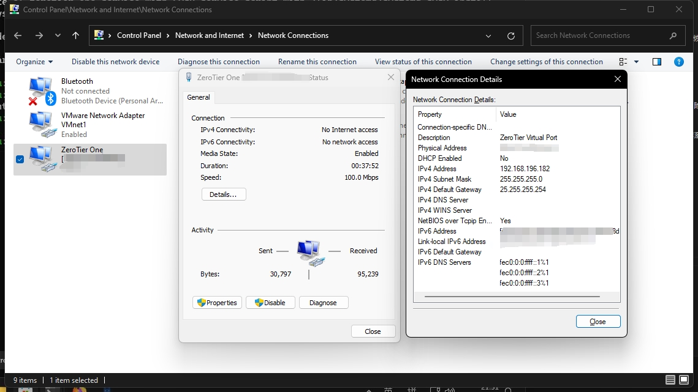

# 大数据技术

## 1. 虚拟化技术

### 1.1 虚拟化的定义和工作原理

虚拟化是一种计算技术，通过抽象化物理硬件资源，创建一个或多个模拟环境或框架，称为虚拟机。这些虚拟机可以模拟整个计算机系统（包括硬件平台、操作系统、存储设备等），使得可以在同一台物理机器上并行运行多个不同的操作系统或应用程序。
虚拟化技术的核心价值在于打破物理设备对于算力和存储等资源的限制，实现资源的更小分配粒度，从而提高资源的利用率，降低成本，并提供更大的灵活性和可扩展性。
可以利用以往局限于硬件的资源来创建有用的 IT 服务。让能够将物理计算机的工作能力分配给多个用户或环境，从而充分利用计算机的所有能力。

物理环境的资源，如计算能力和存储空间，可以根据需求进行分割，并分配给多个虚拟环境。在这些虚拟环境（通常被称为虚拟客户机或虚拟机）内部，用户可以执行和交互计算任务。每个虚拟机都以单一的数据文件形式存在，独立运行。
虚拟机的特性使其具有高度的灵活性和可移植性，可以被视为一种特殊的文件，能够从一台宿主机（即运行虚拟机的物理计算机）迁移到另一台，或在不同的计算机上打开和运行，其功能和性能不会受到影响。
宿主机和虚拟机的关系可以理解为，宿主机提供物理硬件资源，如处理器、内存和存储等，而虚拟机则在这些资源上创建一个隔离的运行环境，模拟出一台完整的计算机，可以运行操作系统和应用程序。
虚拟机与宿主机的硬件资源之间的映射，是通过虚拟化软件来管理和控制的。

### 1.2 虚拟化的历史背景

虚拟化技术起源于20世纪60年代，旨在通过模拟硬件，使多个操作系统能在同一台物理机上并行运行。当时的主要动机是充分利用昂贵的硬件资源。以下是虚拟化技术诞生的历史背景：

1. **硬件资源利用**：早期的计算机非常昂贵，硬件资源很有限。为了最大化地利用这些昂贵的计算机资源，研究人员和工程师开始探索如何在一个物理硬件上运行多个独立的操作系统和应用程序。

2. **时间共享系统**：在多用户环境中，为了提高交互性和响应时间，研究人员开发了时间共享系统，允许多个用户在不同的终端上同时使用同一台计算机。虚拟化技术是支持这种时间共享概念的关键技术之一。

3. **硬件和软件隔离**：随着计算机技术的发展，对系统隔离的需求日益增长。虚拟化技术提供了一种方式，可以在同一硬件上运行多个隔离的环境，从而提高了安全性和稳定性。

4. **灵活性和可扩展性**：随着企业需求的增长，需要更加灵活和可扩展的IT基础设施。虚拟化技术允许动态地分配和调整资源，以满足不同应用程序和工作负载的需求。

5. **灾难恢复和数据保护**：虚拟化技术还提供了更简单的灾难恢复解决方案，因为虚拟机可以被快速复制和迁移到不同的物理服务器上。

20世纪 90 年代。大多数企业都使用物理服务器和单家供应商的技术栈，不支持在不同供应商的硬件上运行旧有应用。随着公司更新各自的 IT 环境，开始使用由多家供应商提供的价格相对低廉的商用服务器、操作系统和应用程序，必然面临着物理硬件利用率不足的问题 — 每台服务器只能运行 1 个供应商特定的任务。
举一个实际例子，假设有 3 台物理服务器，分别用于不同的特定用途。 其中一台是邮件服务器，一台是 Web 服务器，最后一台则用于运行企业的业务应用。
假设每台服务器只使用了大约 30% 的计算容量。相对简单和可靠的做法是在单独的服务器上运行单独的任务：1 台服务器， 1 个运行操作系统，1 个处理任务。
借助虚拟化技术，可以将邮件服务器和web服务器合并到一台机器上，这台机器负载只有60%左右。而另外2台机器就都可以用于业务应用，实现了业务规模的翻倍。

### 1.3 虚拟化类型和工具软件

#### 1.3.1 虚拟化类型

虚拟化技术可以分为以下几种类型：

1. **操作系统级别虚拟化（OS-level virtualization）**：在这种类型的虚拟化中，宿主机的操作系统允许多个隔离的用户空间实例，这些实例通常被称为“容器”。每个容器都运行在自己的用户空间中，但共享同一个内核。Docker就是这种虚拟化技术的一个例子。

2. **全虚拟化（Full virtualization）**：全虚拟化使用一个虚拟机监视器（Hypervisor）来模拟底层硬件。这使得可以在一个物理机器上运行多个不同的操作系统。每个操作系统都认为自己是唯一控制硬件的系统。VMware和VirtualBox都是全虚拟化的例子。

3. **类/半虚拟化（Para-virtualization）**：在这种虚拟化技术中，虚拟机和虚拟机监视器一起协作，提高性能和效率。虚拟机需要被修改以适应这种环境。Xen就是一个类虚拟化的例子。

4. **混合虚拟化（Hybrid-Para virtualization）**：这是全虚拟化和类虚拟化的混合。允许虚拟机无需修改就能运行，同时也允许虚拟机知道自己在虚拟环境中运行，以提高性能。KVM就是混合虚拟化的一个例子。

#### 1.3.2 虚拟化工具软件

常用的虚拟化相关的工具大概有如下这些：

1. **VMware Workstation/Player**：这些是由VMware公司开发的商业虚拟化软件。VMware Workstation提供了全面的虚拟化解决方案，包括服务器虚拟化、桌面虚拟化和网络虚拟化等。VMware Player是一个更简单的版本。优势在于功能全面，性能优秀，支持广泛的操作系统，且有强大的管理和安全功能。劣势在于商用需要购买许可证，成本较高。

2. **Oracle VM VirtualBox**：这是Oracle公司收购的一款开源虚拟化软件。优势在于免费，支持多种操作系统，易于使用，且功能丰富，尤其是具有很方便的虚拟网络管理功能。劣势在于性能相比VMware等商业产品稍逊一筹。

3. **Microsoft Hyper-V**：这是Microsoft的虚拟化解决方案，内置于Windows Server和部分Windows版本中。优势在于与Windows系统的深度集成，管理方便，且性能优秀。劣势在于只能在Windows系统上运行，对其他操作系统的支持不如VMware和VirtualBox。

4. **Kernel-based Virtual Machine (KVM)**：KVM是Linux内核的一部分，提供了基于硬件的虚拟化解决方案。优势在于性能优秀，与Linux系统的深度集成，且开源免费。劣势在于需要处理器支持硬件虚拟化（如Intel VT或AMD-V），且使用和管理相对复杂。

5. **Quick Emulator (QEMU)**：QEMU是一个开源的处理器模拟器和虚拟化器，可以在没有硬件虚拟化支持的系统上提供全系统模拟。优势在于兼容性好，可以模拟多种硬件和处理器，且开源免费。劣势在于性能相比硬件虚拟化的解决方案较差。

6. **libvirt**：libvirt是一个开源的用于管理平台虚拟化技术的API、守护进程和管理工具的集合。可以用于管理KVM，Xen，VMware ESXi，QEMU等。libvirt提供了一个统一的接口，使得管理不同的虚拟化技术变得更加简单。

7. **Xen Project**：Xen是一种开源的虚拟机监视器，提供了全面的虚拟化解决方案。优势在于性能优秀，支持多种虚拟化模式，且开源免费。劣势在于需要处理器支持硬件虚拟化，且对于非专业用户来说，使用和管理相对复杂。

本文推荐的工具软件是VirtualBox和QEMU。
VirtualBox是一种同架构虚拟化软件，可以虚拟出多个与宿主机同样硬件架构的虚拟机。QEMU是一种跨架构的虚拟化软件，可以虚拟出多个与宿主机不同硬件架构的虚拟机。

VirtualBox等软件都可以在一台物理机器上创建多个虚拟机，每个虚拟机可以运行不同的操作系统。每个虚拟机都可以分配不同的处理器和内存资源，以满足不同的需求。就像是一台一台单独的电脑一样。这些虚拟机都是与宿主机相同的硬件架构，比如宿主机是amd64（x86_64），那么虚拟机也可以是amd64（x86_64，64位），也可以是x86（32位）。如果宿主机是x86（32位），那么虚拟机就只能是x86（32位）的了。

QEMU（Quick Emulator）是一种特殊的虚拟化类型，可以在一台物理机器上创建多个虚拟机，但这些虚拟机可以与宿主机同架构，也可以不同架构。当架构相同的时候，可以将QEMU看作是虚拟机；当架构不同的时候，可以兼顾QEMU看作是模拟器。比如宿主机是amd64（x86_64），那么虚拟机也可以是amd64（x86_64，64位），也可以是x86（32位），还可以模拟出aarch64（arm64）、arm（32位）、mips等等架构。

#### 1.3.3 QEMU

在没有硬件辅助的情况下，QEMU可以进行全虚拟化（Full Virtualization），通过二进制翻译来模拟整个硬件环境，使得在一个物理机器上可以运行多个不同的操作系统。

QEMU原生只有字符界面，但本文所用的命令和文件都是现成的 ，而且大家可以使用AI联网来检索具体配置参数的意义和效果等等，所以完全不用怕。

下载安装QEMU需要访问[官方网站](https://www.qemu.org/download/)。

本文也提供了一份适用于Windows系统的绿色版本QEMU9.0，[下载链接](https://pan.baidu.com/s/1SAOppNwQMnM8Pg1Ybi-p6w?pwd=wy0d) , 提取码：`wy0d` 。

不过下载安装之后倒未必能够直接使用，因为现在的操作系统往往需要efi分区等等要素。

那本文这里也提供了一份能够很好地支持上述版本QEMU的`efi.img`文件，[下载链接](https://pan.baidu.com/s/1HlYjcwpowzVNmzpjMXZ6BA?pwd=olfy) , 提取码：`olfy` 。

这个`efi.img`文件可以用于启动QEMU，也可以用于启动QEMU创建的虚拟机。

有了QEMU软件，也有了`efi.img`文件，就可以创建虚拟机了。

首先使用QEMU自带的使用`qemu-img`命令来创建新的空白镜像：

```bash
# 创建压缩的qcow格式
qemu-img create -f qcow2 ubuntu-arm64.qcow2 120G
# 创建通用的img格式
qemu-img create ubuntu-arm64.img 120G
```

上述命令会创建一个120GB的空白镜像文件，可以在这个镜像上安装操作系统。
如果有vhd或者img之类的其他格式的虚拟硬盘，QEMU可以直接使用，也可以转换成为qcow2。
可以使用`qemu-img`命令来进行转换：

```bash
qemu-img convert -f vhd -O qcow2 /path/to/your/vhd/file /path/to/your/qcow2/file
qemu-img convert -O qcow2 -c ubuntu-arm64.img ubuntu-arm64-compressed.qcow2
```

QEMU自带了包括`qemu-system-x86_64`、`qemu-system-arm`（32位）和`qemu-system-aarch64`（64位）等很多个命令，都是对应各自的虚拟架构的。在使用这些命令创建和运行虚拟机的时候，还需要添加适当的CPU和机器模型参数，以及网卡显卡设置等等信息。

例如下面的例子中，已经有从[Ubuntu官网](https://ubuntu.com/download/server/arm)下载好的`ubuntu-24.04-live-server-arm64.iso`这个操作系统安装镜像，还有一个本项目提供好的`efi.img`以及上面创建好的`ubuntu-arm64.img`文件。

下面的命令就是将操作系统安装到对应的虚拟磁盘：

```bash
# 运行系统盘来安装
# Ubuntu Arm 64
qemu-system-aarch64 -M virt,virtualization=true -m 8G -cpu max,pauth-impdef=on -smp 8 -drive if=pflash,format=raw,file=efi.img,readonly=on  --accel tcg,thread=multi -device ramfb -device qemu-xhci -device usb-kbd -device usb-tablet -nic user,model=virtio-net-pci -device usb-storage,drive=install -drive if=none,id=install,format=raw,media=cdrom,file=./ubuntu-24.04-live-server-arm64.iso -drive if=virtio,id=system,format=raw,file=./ubuntu-arm64.img
```

安装完成之后，去掉对应ISO的`-drive`参数，就可以启动系统了：

```bash
# 运行已经安装好的
# Ubuntu Arm 64， 使用img
qemu-system-aarch64 -M virt,virtualization=true -m 8G -cpu max,pauth-impdef=on -smp 8 -drive if=pflash,format=raw,file=efi.img,readonly=on  --accel tcg,thread=multi -device ramfb -device qemu-xhci -device usb-kbd -device usb-tablet -nic user,model=virtio-net-pci -drive if=virtio,id=system,format=raw,file=./ubuntu-arm64.img
```

如果用的不是img文件，而是qcow2文件，把命令改成这样就可以了：

```bash
# Ubuntu Arm 64，使用qcow2
qemu-system-aarch64 -M virt,virtualization=true -m 8G -cpu max,pauth-impdef=on -smp 8 -drive if=pflash,format=raw,file=efi.img,readonly=on  --accel tcg,thread=multi -device ramfb -device qemu-xhci -device usb-kbd -device usb-tablet -nic user,model=virtio-net-pci -drive if=virtio,id=system,format=qcow2,file=ubuntu-arm64.qcow2
```

如果要运行和宿主机同架构的虚拟机，那就可以借助硬件辅助虚拟化（如Intel的VT-x或AMD的AMD-V）。使得QEMU可以利用这些特性来提高虚拟化的性能，这种情况下，QEMU的行为更接近于混合虚拟化（Hybrid-Para Virtualization）。

```Bash
qemu-system-x86_64 -hda /path/to/your/image/file
```

本文提供了一个集成了Ubuntu Server 24.04的ARM64镜像文件，可以直接使用。
下载链接在：[https://pan.baidu.com/s/1L5frJxOW5k_Sy1PNBV_e7w?pwd=09e5](https://pan.baidu.com/s/1L5frJxOW5k_Sy1PNBV_e7w?pwd=09e5) 
提取码：09e5 
默认用户名和密码都是hadoop，解压缩后文件夹应该如下图所示：


从终端进入到解压缩出来的路径：
`cat run_ubuntu_arm64_tiny.bat`，然后复制文件内容来运行命令行版本；
`cat run_ubuntu_arm64.bat`，然后复制文件内容来运行图形界面版本。

#### 1.3.4 Ubuntu Server 上安装QEMU和libvirt

上面的QEMU还是运行在Windows 11这种桌面操作系统上的，如果要在服务器上运行，就可以安装QEMU、kvm和libvirt来实现。

使用以下命令来安装：

```bash
sudo apt update
sudo apt install qemu-kvm libvirt-daemon-system libvirt-clients bridge-utils
```

然后，需要将用户添加到`libvirt`和`kvm`组，以便可以管理虚拟机。可以使用以下命令来做到这一点，将`username`替换为用户名：

```bash
sudo adduser username libvirt
sudo adduser username kvm
```

上面只是安装了基础组件，要在服务器上进行管理和配置，还需要弄从网络来访问和管理服务器上的虚拟机。

因此，接下来，需要安装Cockpit和Cockpit Machines。

Cockpit是一个用于服务器管理的Web UI，Cockpit Machines是一个用于管理虚拟机的Cockpit插件。可以使用以下命令来安装：

```bash
sudo apt install cockpit cockpit-machines
```

然后，需要启动Cockpit服务。可以使用以下命令来启动服务，并设置它在启动时自动运行：

```bash
sudo systemctl start cockpit
sudo systemctl enable cockpit
```

最后，可以在浏览器中访问`https://<your-server-ip>:9090`来访问Cockpit。需要使用服务器的用户名和密码来登录。

在Cockpit中，可以点击左侧的"Virtual Machines"选项来管理虚拟机。可以创建新的虚拟机，或者管理已经存在的虚拟机。

#### 1.3.5 VirtualBox

有许多网站提供预构建的镜像文件，可以直接下载并使用。可以从Linux发行版的官方网站下载ISO文件，或者从网站如[OSBoxes](https://www.osboxes.org/)或[Vagrant Boxes](https://app.vagrantup.com/boxes/search)下载预构建的虚拟机镜像。

VirtualBox 的安装比较简单，大家直接去官网下载就可以了。

VirtualBox 的处理器和内存设置等等都已经很简单且很直观了。

一般来说，四个处理器核心基本足够日常的简单场景。



对于内存，一般需要设置为 8GB 以上，不过这需要宿主机至少有 16GB 以上的内存才行，否则可能会有很明显的卡顿。



以Windows系统下的VirtualBox为例，半虚拟化接口有空、默认、旧的、最少、Hyper-V、KVM这几种，具体区别如下：

* 空: 这种模式下，不启用任何特定的半虚拟化接口。
* 默认: 这种模式下，VirtualBox会自动选择最适合当前系统的半虚拟化接口。
* 旧的: 这种模式下，VirtualBox会使用旧的半虚拟化接口，这可能在一些老旧的系统上有更好的兼容性。
* 最少: 这种模式下，VirtualBox会尽可能少地使用半虚拟化接口，以减少对主机系统的影响。
* Hyper-V: 这种模式下，VirtualBox会使用Windows的Hyper-V作为半虚拟化接口。这需要Windows 10或更高版本，并且已经启用了Hyper-V功能。
* KVM: 这种模式下，VirtualBox会使用Linux的KVM作为半虚拟化接口。这需要Linux内核支持KVM，并且已经启用了KVM模块。


相比于 VMware Player 等其他竞品，VirtualBox有更细致的网络配置选项。

VirtualBox 的网络适配器类型有如下类型：

* 网络地址转换（NAT）: 这种模式允许虚拟机访问外部网络，但外部网络不能直接访问虚拟机。这是默认的网络设置。
* 桥接网络: 这种模式允许虚拟机直接连接到物理网络，就像它是网络上的另一台独立的计算机一样。
* 内部网络: 这种模式只允许虚拟机之间相互通信，它们不能访问宿主机或外部网络。
* 仅主机（Host-Only）网络: 这种模式允许虚拟机与宿主机进行通信，但不能访问外部网络。
* 通用驱动: 这是一种可以在不同的网络环境中工作的网络驱动。
* NAT 网络: 这是一种特殊的网络模式，允许多个虚拟机共享同一个NAT服务。
* 云网络[试验功能]: 这是一种实验性的网络模式，用于在云环境中部署虚拟机。
* 未指定: 这表示没有选择任何网络模式。



建议大家不要轻易使用桥接网络，因为这样会使得虚拟机和宿主机完全位于统一网段，不同的物理机上的虚拟机之间万一有物理地址或者ip地址的冲突就可能很麻烦了。

一般来说建议使用NAT和仅主机网络，这样虚拟机和宿主机就完全隔离开了。
虚拟机可以通过NAT网络来访问外部网络，而宿主机可以通过仅主机网络来访问虚拟机。

在VirtualBox中，网络地址转换（NAT）和NAT网络的主要区别在于处理虚拟机之间和外部网络通信的方式。

* **网络地址转换（NAT）**：在这种模式下，每个虚拟机都有自己的NAT服务，它们不能直接相互通信，但可以访问外部网络。每个虚拟机看起来就像是从主机进行网络访问的另一个应用程序。

* **NAT网络**：在这种模式下，多个虚拟机可以共享同一个NAT服务。这意味着虚拟机可以相互通信，并且可以访问外部网络。这种模式更接近于一个真实的网络环境，因为虚拟机可以使用相同的网络地址空间进行通信。

VirtualBox 性能终究是有些损失，也就是适合做日常的简单使用，尽量不能用于生产环境。

真要用到商用场景，还是推荐用 PVE+KVM 这类组合。

#### 1.3.6 Windows下Hyper V的快速启用和停用

在Windows系统中，当Hyper-V被启用时，它会占用硬件虚拟化的资源，导致其他虚拟化软件（如VirtualBox）无法访问这些资源。

想在VirtualBox中使用嵌套虚拟化，需要先禁用Hyper-V，以便VirtualBox可以访问硬件虚拟化支持。然后，可以在VirtualBox的虚拟机设置中启用嵌套虚拟化。

请注意，禁用Hyper-V可能会影响到依赖Hyper-V的其他功能，如Windows Sandbox和WSL2。在禁用Hyper-V之前，应该考虑这些影响，并确保系统有足够的资源来支持嵌套虚拟化。

可以使用以下的PowerShell命令来禁用Hyper-V和Windows Hypervisor Platform（以管理员身份运行PowerShell）：

```powershell
Disable-WindowsOptionalFeature -Online -FeatureName Microsoft-Hyper-V-All
Disable-WindowsOptionalFeature -Online -FeatureName HypervisorPlatform
bcdedit /set hypervisorlaunchtype off
```

然后，需要重启电脑以使更改生效。

请注意，禁用Hyper-V和Windows Hypervisor Platform可能会影响到依赖它们的其他功能，如Windows Sandbox和WSL2。

如果想要恢复上面禁用的Hyper-V和Windows Hypervisor Platform，可以使用以下的PowerShell命令（以管理员身份运行PowerShell）：

```powershell
Enable-WindowsOptionalFeature -Online -FeatureName Microsoft-Hyper-V-All
Enable-WindowsOptionalFeature -Online -FeatureName HypervisorPlatform
bcdedit /set hypervisorlaunchtype auto
```

然后，需要重启电脑以使更改生效。

这些命令会重新启用Hyper-V和Windows Hypervisor Platform，允许它们再次访问硬件虚拟化的资源。
注意，启用这些功能可能会影响到VirtualBox的嵌套虚拟化功能。

### 1.4 虚拟化技术与大数据

虚拟化技术使得大数据处理能够在分布式环境中进行，提高了数据处理的效率和灵活性。

大数据技术需要用到虚拟化的主要原因如下：

1. **资源池化和动态分配**：大数据应用通常需要大量的计算和存储资源，这些资源的需求可能会随时间变化。虚拟化技术允许将物理资源（如CPU、内存、存储）池化，根据大数据应用的需求动态分配和调整这些资源，从而提高资源利用率和系统效率。

2. **环境隔离和安全性**：大数据系统往往涉及敏感数据和高价值的服务。虚拟化提供的隔离性可以确保不同的应用和服务在各自的虚拟环境中运行，减少安全漏洞和跨应用干扰的风险。

3. **灵活的扩展性和高可用性**：大数据应用需要能够快速响应数据量的增长和处理需求的提升。虚拟化技术使得添加或移除资源变得简单快捷，支持应用的横向扩展。同时，虚拟化还支持实时迁移和故障转移，提高了系统的可用性和容错能力。

4. **成本效益**：通过虚拟化，多个大数据服务可以共享同一物理硬件，减少了硬件采购和运维成本。此外，虚拟化还可以降低能源消耗，进一步减少运营成本。

5. **支持多租户架构**：在云环境中，虚拟化技术支持多租户架构，使得不同的用户或组织可以在同一物理硬件上运行各自的大数据应用，同时保持数据和配置的隔离。

6. **简化管理和维护**：虚拟化提供了简化的管理界面和自动化工具，使得大数据环境的配置、监控和维护变得更加高效。

虚拟化技术为大数据提供了一个灵活、高效、安全的运行环境，是支持大数据技术发展的关键基础设施。

#### 1.4.1 虚拟机的性能损失

在虚拟化环境中运行的大数据应用可能会遇到性能损失。

虚拟化技术通过在物理硬件上运行多个虚拟机来实现资源池化和动态分配。

然而，虚拟化技术也会引入一些性能损失，这些损失可能来自于以下几个方面：

1. **硬件虚拟化开销**：虚拟化技术需要模拟物理硬件的功能，这个环节必然会有性能损失。

2. **网络开销**：虚拟化技术需要使用虚拟网络资源连接虚拟机和外部网络，IO方面总会存在上限，背板带宽未必充足。

3. **存储开销**：虚拟化技术需要使用虚拟磁盘和虚拟磁盘控制器，但速度和性能表现往往未必能与物理设备相比。

4. **安全和安全开销**：虚拟化技术需要使用虚拟机监控程序等等，必然也会有额外的性能开销。

#### 1.4.2 虚拟机的宕机问题

在虚拟化环境中运行的大数据应用可能会遇到宕机问题。

比如可能会出现运行资源不够的情况，导致虚拟机无法正常运行，就会发生宕机。

一旦宕机，就会发生数据丢失、服务中断等问题，对业务造成严重影响。

为了避免虚拟机宕机，可以考虑采取以下措施：

1. **资源监控和自动扩展**：通过监控虚拟机的资源使用情况，提前预测资源需求，并进行自动扩展，确保虚拟机有足够的资源运行。

2. **故障转移和恢复**：当虚拟机发生宕机时，可以进行故障转移和恢复操作，将虚拟机迁移到其他可用资源上，确保业务不受影响。


#### 1.4.3 虚拟机的迁移问题

然而物理上的资源始终存在上限，虚拟机过多了，或者负载过重，又或者运行过久了，都可能导致物理资源不足，到时候就难免需要迁移虚拟机。虚拟机迁移的目的是为了将虚拟机从一个物理主机转移到另一个物理主机上，以实现负载均衡、资源利用最大化、故障转移和恢复等目的。虚拟机迁移需要考虑以下几个方面：

1. **数据一致性**：虚拟机迁移需要将虚拟机的数据和配置文件迁移到新的物理主机上，确保数据和配置文件的完整性和一致性。

2. **宕机时间**：虚拟机迁移需要关机进行，这就导致对应的业务不可避免地要发生中断。因此有必要在迁移前进行评估，确定迁移对业务的影响程度，并制定相应的迁移计划和策略。

3. **迁移后的维护**：虚拟机迁移后，需要对新的物理主机进行必要的维护和配置，确保虚拟机能够正常运行。


## 2. 容器技术

### 2.1 容器技术概述

容器是一种轻量级的虚拟化技术，可以将应用及其依赖打包在一起，实现快速、一致的部署。
容器技术是一种操作系统级别的虚拟化技术，允许在单个系统上运行多个隔离的用户空间实例，而不是使用硬件虚拟化技术在单个系统上运行多个完整的操作系统实例。这些用户空间实例被称为“容器”。
容器技术的起源可以追溯到早期的Unix系统，其中的chroot机制就是一种原始的容器化实现。chroot允许将进程及其子进程限制在文件系统的特定部分中，从而在一定程度上实现了文件系统级别的隔离。
在2000年代，随着FreeBSD Jail、Solaris Zones和Linux的OpenVZ等技术的出现，容器技术开始逐渐成熟。这些技术提供了更强大的隔离机制，允许每个容器拥有自己的网络接口、进程空间和用户空间等。
2013年，Docker的出现标志着容器技术的一个重要里程碑。Docker简化了容器的创建和管理，使得容器技术得到了广泛的应用。
容器技术与虚拟化技术的主要区别在于它们的隔离级别和性能开销。虚拟化技术通过模拟硬件来运行多个操作系统实例，每个实例都拥有自己的内核，因此可以运行不同的操作系统。
而容器技术则是在同一个操作系统内核上运行多个用户空间实例，因此所有容器必须运行相同的操作系统。
由于容器技术避免了硬件模拟的开销，因此通常比虚拟化技术更轻量级，性能更高。

### 2.2 容器化大数据微服务

#### 大数据系统的架构

1. **批处理架构**：这是一种传统的大数据处理架构，通常使用Hadoop等框架进行大规模的数据处理。这种架构适合处理大量的静态数据，但不适合实时处理。

2. **实时处理架构**：这种架构使用如Apache Storm或Apache Flink等框架，可以实时处理流式数据。

3. **Lambda架构**：这种架构结合了批处理和实时处理的优点。将数据处理分为批处理层和速度层，批处理层处理历史数据，速度层处理实时数据。

4. **Kappa架构**：这是一种简化的Lambda架构，使用消息队列（如Kafka）替代Lambda架构中的批处理层，只有一个处理层，消息中间件缓存的数据量和回溯数据可能存在性能瓶颈，实时数据处理时可能因数据流顺序问题导致数据丢失，放弃了离线数据处理的稳定性。

5. **微服务架构**：这种架构将应用拆分为多个微服务，每个微服务都独立运行在其自身的进程中，并通过HTTP API进行通信。每个微服务都有自己的独立任务，可以独立地进行开发和部署，可以独立扩展和升级。

在大数据环境下，微服务架构优势明显，尤其体现在扩展性和灵活性上。容器化技术进一步提升了大数据处理的效率和可扩展性，这在微服务架构中尤为突出。
以一个大数据应用为例，它可能由多个微服务组成，包括数据收集、数据处理、数据存储和数据分析等。
这些服务都能独立扩展，以满足各自的需求。例如，当数据收集的负载增加时，可以增加数据收集服务的实例，而不会对其他服务产生影响。

#### 容器的优势

在大数据的微服务架构中，容器相比于虚拟化有以下独特的优势：

1. **更高的效率**：容器共享主机系统的操作系统内核，避免了虚拟机需要运行完整操作系统的开销。这使得容器在CPU、内存和存储使用上更加高效。

2. **更快的启动时间**：容器可以在几秒甚至毫秒内启动和停止，这比虚拟机的启动时间快得多。这对于需要快速扩展和收缩的大数据微服务架构来说非常重要。

3. **更好的可扩展性**：由于容器的轻量级和快速启动特性，可以快速地启动新的容器实例来处理增加的负载，这对于大数据处理来说非常有用。

4. **更强的隔离性**：虽然容器共享操作系统内核，但每个容器都在自己的用户空间中运行，有自己的文件系统、进程空间和网络接口。这为微服务提供了良好的隔离环境。

5. **更方便的版本控制和部署**：容器可以将应用程序和其依赖打包在一起，形成一个可移植的、自包含的单元。这使得应用程序的部署、升级和回滚变得更加简单和可控。

6. **更好的微服务支持**：容器天然适合微服务架构。每个微服务可以打包在一个或多个容器中，每个容器都可以独立地扩展和部署。

### 2.3 使用Kubernetes进行容器编排

Kubernetes，简称K8s，是一款开源的容器编排平台，它自动化了容器化应用的部署、扩展和管理过程。该系统的设计初衷是为了解决在分布式环境中容器化应用部署、管理及扩展的复杂性。
随着Docker等容器技术的普及，开发人员开始将应用程序打包进容器中，这一做法带来了显著的好处，如环境一致性和快速部署。
然而，随着容器数量的激增，手动管理这些容器变得不再可行，因此，亟需一种自动化的系统来高效管理这些容器。
Kubernetes 最初由Google在2014年开源，并随后捐赠给了云原生计算基金会（Cloud Native Computing Foundation，CNCF）。
Kubernetes的设计灵感源自Google内部的大规模集群管理系统Borg，Google利用Borg来运行和管理其在线服务。
Kubernetes继承了Borg的优秀基因，使其成为了一个高效、可靠且功能强大的容器编排解决方案。

#### **Kubernetes的主要目标包括：**

1. **自动化部署**：自动化容器的部署和更新，确保应用能够在任何时间点都是可用的。

2. **负载均衡**：通过负载均衡将流量分配到不同的容器，确保应用在高负载下仍然稳定运行。

3. **服务发现**：允许容器彼此查找和通信，即使们的位置和数量在集群中动态变化。

4. **自我修复**：在容器失败时自动重启容器，确保应用的持续可用性。

5. **横向自动扩展**：根据工作负载自动增加或减少容器的数量，以保持应用的性能和响应速度。

6. **资源管理**：有效管理集群资源，确保容器只使用们需要的资源，并在资源不足时进行优先级排序。

7. **密钥和配置管理**：安全地管理应用配置和敏感信息，如密码和密钥。

Kubernetes通过提供这些功能，使得在复杂的生产环境中运行容器化应用变得更加简单和可靠。允许开发人员专注于编写应用程序，而不必担心底层基础设施的管理。

#### **Kubernetes的诞生过程：**

1. **Google的Borg系统**：Google在2003年开始开发Borg系统，用于管理和调度他们的数据中心资源。Borg系统在Google内部使用了十多年，积累了大量的经验和技术。

2. **开源和捐赠**：2014年，Google决定将Borg的设计理念和经验开源，于是创建了Kubernetes项目。2015年，Google将Kubernetes捐赠给了CNCF，使其成为了一个真正的社区驱动的项目。

#### **Kubernetes的优势：**

1. **强大的容器编排能力**：Kubernetes可以自动化部署、扩展和管理容器化应用程序。

2. **服务发现和负载均衡**：Kubernetes可以自动分配IP地址和DNS名称给服务，并可以在服务实例之间进行负载均衡。

3. **自动化滚动更新和回滚**：Kubernetes可以管理应用程序的生命周期，包括自动滚动更新和回滚。

4. **强大的社区支持**：Kubernetes有一个活跃的开源社区，有大量的贡献者和用户。

#### **Kubernetes的劣势：**

1. **学习曲线陡峭**：Kubernetes的概念和API复杂，对新手来说学习曲线可能会比较陡峭。

2. **配置复杂**：Kubernetes的配置和管理相对复杂，需要专业的知识和经验。

3. **资源消耗**：Kubernetes本身会消耗一部分系统资源，对于小型的应用或者小型的集群，这部分资源消耗可能会比较明显。

### 2.4 容器与编排系统

#### 2.4.1 Docker 安装

在Ubuntu Server 22.04上使用`apt`来安装Docker和Docker Compose的步骤：

1. 更新的包列表：

```bash
sudo apt-get update
```

2. 安装Docker：

```bash
sudo apt-get install docker.io docker-buildx
```

3. 启动Docker服务，并设置它在启动时自动运行：

```bash
sudo systemctl start docker
sudo systemctl enable docker
```

4. 验证Docker是否安装成功：

```bash
sudo docker run hello-world
```

这个命令将会下载一个测试镜像，然后运行一个容器。如果容器运行成功，并且能看到一条消息，那么说明Docker已经成功安装。

接下来，可以安装Docker Compose。首先，使用`apt`来安装Docker Compose：

```bash
sudo apt-get install docker-compose
```

然后，验证Docker Compose是否安装成功：

```bash
docker-compose --version # 老版本的命令，在咱们用的Ubuntu22.04的虚拟机里
docker compose --version # 新版本的命令，在咱们用的Ubuntu24.04的虚拟机里
```

这个命令将会打印出Docker Compose的版本，如果能看到版本号，那么说明Docker Compose已经成功安装。

#### 2.4.2 Docker 权限配置

在Ubuntu 24.04下，如果想让当前用户可以运行Docker而不需要使用`sudo`，可以将当前用户添加到`docker`用户组。以下是具体步骤：

1. 打开一个终端。

2. 运行以下命令以创建`docker`组（如果它还不存在）并将当前用户添加到该组：

```bash
sudo groupadd docker
sudo usermod -aG docker $USER
```

3. 重启电脑，或者注销并重新登录，以使这些更改生效。

4. 为了验证更改是否生效，可以运行以下命令，如果它能够无需`sudo`就能成功运行，那么就说明更改已经生效：

```bash
docker run hello-world
```

这个命令会尝试运行一个名为`hello-world`的Docker容器。如果一切正常，应该能看到一些关于Docker的欢迎信息。

请注意，将用户添加到`docker`组会赋予他们类似于`root`用户的权限，因为他们现在可以运行Docker容器。在某些情况下，这可能会带来安全风险，所以请确保了解这些风险。

#### 2.4.3 Docker 宿主端配置GPU访问支持和CUDA库

在Ubuntu 24.04上，可以使用以下步骤从命令行创建一个Ubuntu 24.04的Docker容器，并使用宿主的NVIDIA GPU和CUDA：

首先，宿主机端，需要安装NVIDIA的CUDA。此步骤参考[https://developer.nvidia.com/cuda-downloads](https://developer.nvidia.com/cuda-downloads)即可。

然后还要安装NVIDIA的Docker工具，这个工具可以让Docker容器访问宿主机的NVIDIA GPU。在终端中运行以下命令：

```bash
# 添加NVIDIA包的公钥以及NVIDIA Docker的存储库
curl -fsSL https://nvidia.github.io/libnvidia-container/gpgkey | sudo gpg --dearmor -o /usr/share/keyrings/nvidia-container-toolkit-keyring.gpg \
  && curl -s -L https://nvidia.github.io/libnvidia-container/stable/deb/nvidia-container-toolkit.list | \
    sed 's#deb https://#deb [signed-by=/usr/share/keyrings/nvidia-container-toolkit-keyring.gpg] https://#g' | \
    sudo tee /etc/apt/sources.list.d/nvidia-container-toolkit.list

# 更新包列表
sudo apt-get update

# 安装nvidia-docker2 如果是docker镜像内则要去掉sudo
sudo apt-get install -y nvidia-container-toolkit

# 重启Docker服务
sudo systemctl restart docker
```

#### 2.4.4 Docker 容器启动附带GPU访问和CUDA支持

然后，可以使用以下命令创建一个Ubuntu 24.04的Docker容器，并使用宿主的NVIDIA GPU：

```Bash
docker run --gpus all -it --name ailab --hostname ailab chinageology/ailab:latest
# docker run -p 8888:8888 --gpus all -it --name ailab --hostname ailab chinageology/ailab:latest /bin/bash
```

在这个命令中，`--gpus all`参数告诉Docker使用所有可用的GPU。`-it`参数让Docker在交互模式下运行，这样就可以在容器内部运行命令。`chinageology/ailab:latest`是要运行的Docker镜像的名称。`ailab`是容器的名称。这个命令将会创建一个名为`ailab`的Docker容器，并使用宿主的NVIDIA GPU。

然后，可以使用以下命令来进入容器：

```Bash
docker exec -it ailab /bin/bash
```

这个命令将会进入名为`ailab`的容器，并使用`/bin/bash`命令来启动一个交互式shell。

接下来，下载安装miniconda3，可以访问 [https://mirrors.tuna.tsinghua.edu.cn/anaconda/miniconda/](https://mirrors.tuna.tsinghua.edu.cn/anaconda/miniconda/) 获得对应版本的最新安装包。以`miniconda3-latest`为关键字来搜索，就能找到最新的。这里以[https://mirrors.tuna.tsinghua.edu.cn/anaconda/miniconda/Miniconda3-latest-Linux-x86_64.sh](https://mirrors.tuna.tsinghua.edu.cn/anaconda/miniconda/Miniconda3-latest-Linux-x86_64.sh)为例：

```bash
wget https://mirrors.tuna.tsinghua.edu.cn/anaconda/miniconda/Miniconda3-latest-Linux-x86_64.sh
chmod +x Miniconda3-latest-Linux-x86_64.sh
./Miniconda3-latest-Linux-x86_64.sh
```

接下来，安装miniconda3好了之后，配置环境变量。

```bash
conda init
conda activate base
```

然后，可以运行以下命令来安装`PyTorch`和`CUDA`：

```Bash
conda install pytorch torchvision torchaudio pytorch-cuda=12.4 -c pytorch-nightly -c nvidia
```

这个命令将会安装最新版本的PyTorch和CUDA。

然后在容器中运行下列代码来测试是否成功：

```python
import torch
# 打印PyTorch版本
print("PyTorch Version:", torch.__version__)
# 检查CUDA是否可用
if torch.cuda.is_available():
    print("CUDA is available. GPU support is enabled.")
    print("GPU Name:", torch.cuda.get_device_name(0))
else:
    print("CUDA is not available. GPU support is not enabled.")
```
    
如果输出为`True`，则说明CUDA已经成功安装。

这样，就在Ubuntu 24.04上从命令行创建了一个Ubuntu 24.04的Docker容器，并使用了宿主的NVIDIA GPU和CUDA，来运行PyTorch和CUDA。


#### 2.4.5 Docker 镜像的打包压缩

将名为 `ailab` 的 Docker 容器打包、压缩成本地文件，并在另一台机器上导入运行，可以按照以下步骤操作：

1. **将容器保存为镜像**:
首先，需要将运行中的容器 `ailab` 提交为一个新的镜像。这可以通过 `docker commit` 命令完成。

```bash
docker commit ailab chinageology/ailab:latest
```

这里，`ailab` 是容器的名称或ID，`chinageology/ailab:latest` 是为这个镜像指定的名称和标签。

2. **将镜像保存为 tar 文件**:
接下来，使用 `docker save` 命令将刚才创建的镜像保存为一个 tar 文件。

```bash
docker save chinageology/ailab:latest > ailab-image.tar
# 如果宿主机是GNU/Linux，压缩需要用下面的命令：
docker save chinageology/ailab:latest | gzip > ailab-image.tar.gz
```

这会创建一个名为 `ailab-image.tar` 的文件，包含了镜像的所有层。

3. **将 tar 文件复制到另一台机器**:
使用某一种方法将 `ailab-image.tar` 文件复制到目标机器上。例如，可以使用 `scp`, `rsync` 或者通过 USB 驱动器等物理介质。

```bash
scp ailab-image.tar user@target-machine:/path/to/destination
```


4. **在目标机器上加载镜像**:


在目标机器上，使用 `docker load` 命令从 tar 文件中加载镜像。

`docker load` 命令不能直接用于加载 `.zip` 文件。
`docker load` 命令期望输入格式为 `.tar` 文件，特别是那些通过 `docker save` 命令创建的 `.tar` 文件。
如果有一个 `.zip` 文件（例如 `ailab-image.zip`），需要先解压这个文件，然后再使用 `docker load` 命令加载解压后的 `.tar` 文件。

```bash
docker load < ailab-image.tar
gunzip -c ailab-image.tar.gz | docker load
docker load < ailab-image.tar.gz
```

5. **运行镜像**:
最后，在目标机器上，可以像平常一样使用 `docker run` 命令来运行这个镜像。

```bash
docker run -p 8888:8888 --gpus all -it --name ailab --hostname ailab chinageology/ailab:latest
```

这样，就成功地将一个运行中的 Docker 容器打包、压缩，并在另一台机器上导入并运行了。

#### 2.4.6 Docker 镜像和容器的删除

要删除本地的所有Docker容器和镜像，请按照以下步骤操作。请注意，这些操作将会删除所有容器和镜像，包括未使用的和正在运行的，因此请确保确实希望执行这些操作。

###### 删除所有容器

首先，停止所有正在运行的容器：

```bash
docker stop $(docker ps -aq)
```

然后，删除所有容器（包括未运行的）：

```bash
docker rm $(docker ps -aq)
```

###### 删除所有镜像

删除所有Docker镜像：

```bash
docker rmi -f $(docker images -q)
```

###### 注意

- 上述命令中使用的`$(docker ps -aq)`和`$(docker images -q)`分别用于获取所有容器的ID和所有镜像的ID。
- 如果在尝试删除镜像时遇到错误，表示有容器仍在使用某些镜像。确保所有容器都已被删除后再次尝试。
- 如果想要强制删除正在使用的镜像，可以在`docker rmi`命令中加上`-f`参数，即`docker rmi -f $(docker images -q)`。

执行这些命令后，Docker环境将被清理，所有本地的容器和镜像都将被删除。请谨慎操作，确保不会误删重要的容器或镜像。

#### 2.4.7 容器的定制

要创建一个包含最新版 CUDA 支持以及最新的 PyTorch GPU 加速的 Ubuntu 24.04 系统的 Docker 容器，可以遵循以下步骤：

1. **启用实验特性**

编辑或创建 Docker 配置文件 `nano ~/.docker/config.json`。
添加或更新配置以启用实验性特性：

```json
{
   "experimental": "enabled"
}
```

保存文件并重启 Docker 服务。这可以通过运行 `sudo systemctl restart docker` 来完成。

启用实验性特性后，应该能够使用 Docker buildx。可以通过运行 `docker buildx version` 来验证 buildx 是否可用。


2. **选择合适的基础镜像**：找到一个包含 Ubuntu 24.04 和最新版 CUDA 的基础镜像。然而，由于 Ubuntu 24.04 是一个未来的版本（假设指的是一个新版本，因为截至我的知识更新日期，最新的 LTS 版本是 Ubuntu 22.04），可能还没有直接包含 CUDA 的官方镜像。因此，可能需要从一个包含最新 CUDA 的官方 NVIDIA 镜像开始，该镜像基于 Ubuntu 的最新 LTS 版本。

3. **安装 PyTorch**：在容器内部，可以使用 PyTorch 官方提供的命令来安装最新版本的 PyTorch，确保安装的是支持 CUDA 的版本。


以下是一个 Dockerfile 的示例，展示如何从 NVIDIA CUDA 的官方镜像开始构建，然后安装 PyTorch：

```Dockerfile
# 使用 NVIDIA CUDA 12.5 基础镜像，基于 Ubuntu 22.04
FROM nvidia/cuda:12.5.0-runtime-ubuntu22.04

# 设置非交互式安装，避免安装过程中的提示
ENV DEBIAN_FRONTEND=noninteractive

# 安装 Python 3 和 pip
RUN apt-get update && apt-get install -y python3 python3-pip 

# 安装 PyTorch (确保选择支持 CUDA 版本的 PyTorch)
RUN pip3 install --pre torch torchvision torchaudio --index-url https://download.pytorch.org/whl/nightly/cu124

# 设置工作目录
WORKDIR /workspace

# 当容器启动时，默认执行 bash
CMD ["/bin/bash"]
```

Dockerfile 通常没有扩展名，它的文件名就是 `Dockerfile`。
在构建 Docker 镜像时，Docker 会默认查找名为 `Dockerfile` 的文件。

这个 Dockerfile 做了以下几件事情：

- 从 NVIDIA 的 CUDA 12.5 基础镜像开始，该镜像基于 Ubuntu 22.04。可以根据需要选择其他版本的 CUDA 镜像。
- 安装 Python 3 和 pip。
- 使用 pip 安装 PyTorch，这里使用的是支持 CUDA 12.4的版本。需要根据选择的 CUDA 基础镜像版本来安装相应版本的 PyTorch。

构建这个 Dockerfile：

```bash
docker build -t pytorch-cuda:latest .
```

一旦启用了 BuildKit，就可以使用 `docker build` 命令来构建镜像，BuildKit 将自动被使用。如果想使用 Buildx 的特定功能，可以使用 `docker buildx build` 命令代替。例如：

```bash
sudo apt install docker-buildx
export DOCKER_BUILDKIT=1
sudo docker buildx build -t pytorch-cuda:latest --load .
```

这个命令会使用 Buildx 构建镜像。

然后会出现类似下面的输出：
```Bash
d$ sudo docker buildx build -t pytorch-cuda:latest --load .
[+] Building 16.3s (3/7)                                                docker:default
 => [internal] load .dockerignore                                                 0.0s
 => => transferring context: 2B                                                   0.0s
 => [internal] load build definition from Dockerfile                              0.0s
 => => transferring dockerfile: 603B                                              0.0s
 => [internal] load metadata for docker.io/nvidia/cuda:12.5.0-runtime-ubuntu22.0  2.7s
 => [1/4] FROM docker.io/nvidia/cuda:12.5.0-runtime-ubuntu22.04@sha256:75292ffa  13.6s
 => => resolve docker.io/nvidia/cuda:12.5.0-runtime-ubuntu22.04@sha256:75292ffab  0.0s
 => => sha256:75292ffaba88ea846d7f28261d4ed302fbe1124f10ff9da30e4403 743B / 743B  0.0s
 => => sha256:159a957801e9b3b3df287adec3a569f5e280d0aaa44497f379 2.21kB / 2.21kB  0.0s
 => => sha256:5b5f281aa9fa4a9763403c8fc11286d206399af64435f863af 4.62MB / 4.62MB  0.9s
 => => sha256:15964878accaa6993ed81b455f2b270627dcbbcc417bc2b8 14.43kB / 14.43kB  0.0s
 => => sha256:a8b1c5f80c2d2a757adc963e3fe2dad0b4d229f83df3349f 29.53MB / 29.53MB  2.4s
 => => sha256:e85ef0eeb66cb32e80ff3b515ccf662a7e334b8009ae052e 55.93MB / 55.93MB  4.2s
 => => sha256:0d0a907de515114944527766676078f7f87a89d577cc3b003081e8 183B / 183B  1.6s
 => => sha256:508725ab4fe4de0456be39a9357fb6a12224074ad7eecdfbeb 6.89kB / 6.89kB  2.1s
 => => sha256:496b16ddfbf2c518b770e1f6c6717403904bd9cfbf89c66 324.01MB / 1.36GB  13.6s
 => => sha256:a2c7209f2750da3fabd70d4ea0408ff8e845811da4e2f8f6 64.10kB / 64.10kB  3.1s
 => => extracting sha256:a8b1c5f80c2d2a757adc963e3fe2dad0b4d229f83df3349fbb70e4d  1.0s
 => => sha256:522339e778aca8bebe341f07f192a3484d19356e1095c72804 1.69kB / 1.69kB  3.5s
 => => extracting sha256:5b5f281aa9fa4a9763403c8fc11286d206399af64435f863af023a0  0.2s
 => => sha256:5cb97a32151bc38e8cc3fc80975ad5fde5d2ea28c837b3ae4b 1.52kB / 1.52kB  4.0s
 => => extracting sha256:e85ef0eeb66cb32e80ff3b515ccf662a7e334b8009ae052ec344ab4  0.9s
 => => extracting sha256:0d0a907de515114944527766676078f7f87a89d577cc3b003081e8b  0.0s
 => => extracting sha256:508725ab4fe4de0456be39a9357fb6a12224074ad7eecdfbeb8f280  0.0s
```

通过这些步骤，可以在命令行界面下使用 BuildKit 来构建 Docker 镜像，从而解决因使用旧版构建器而出现的弃用警告。如果没有特定的需求要直接使用 Buildx 的特定功能，简单地设置环境变量 `DOCKER_BUILDKIT=1` 并使用 `docker build` 命令就足够了。

运行容器：

```bash
docker run --gpus all -it pytorch-cuda:latest
```

请注意，这个示例使用的是 Ubuntu 22.04，可以根据实际情况调整 CUDA 和 Ubuntu 的版本。

#### 2.4.8 k8s 安装

在Ubuntu Server中，可以使用MicroK8s来管理容器。MicroK8s是一个轻量级的Kubernetes发行版，它可以在Ubuntu Server上运行，并且包含了大部分Kubernetes的功能。

首先，需要在Ubuntu Server上安装MicroK8s。可以使用以下命令来安装：

```bash
sudo snap install microk8s --classic
```

然后，可以使用`microk8s`命令来管理的Kubernetes集群。例如，可以使用以下命令来查看集群的状态：

```bash
sudo microk8s status
```

不过，默认安装下的`microk8s`可能需要检测一下配置信息，需要运行命令如下：

```Bash
sudo microk8s inspect 
```

比如下面是一个实例上的显示：
```Bash
WARNING:  Docker is installed.
File "/etc/docker/daemon.json" does not exist.
You should create it and add the following lines:
{
    "insecure-registries" : ["localhost:32000"]
}
and then restart docker with: sudo systemctl restart docker
```

根据提示，就要添加配置文件`sudo nano /etc/docker/daemon.json`，内容如下：

```Bash
{
    "insecure-registries" : ["localhost:32000"]
}
```

然后，重启Docker服务：

```Bash
sudo systemctl restart docker
```

然后，再次运行`microk8s inspect`命令，应该就能看到配置信息了。

接下来，可以使用以下命令来启用Kubernetes的组件：

```bash
sudo microk8s enable dns
sudo microk8s enable registry
```


对于Web界面，Kubernetes有一个叫做Dashboard的Web UI。可以使用以下命令来启用它：

```bash
sudo microk8s enable dashboard
```

然后，可以使用以下命令来获取访问Dashboard的令牌：

```bash
token=$(microk8s kubectl -n kube-system get secret | grep default-token | cut -d " " -f1)
microk8s kubectl -n kube-system describe secret $token
```

最后，可以在的浏览器中访问`https://<your-server-ip>:10443`来访问Dashboard。需要使用上面获取的令牌来登录。

注意，由于MicroK8s使用的是自签名证书，所以可能需要在浏览器中接受安全警告才能访问Dashboard。

在Kubernetes中，可以使用Deployment来创建和管理Docker容器。以下是一个简单的例子，它创建了一个名为`nginx-deployment`的Deployment，该Deployment运行了两个nginx Docker容器：

```yaml
apiVersion: apps/v1
kind: Deployment
metadata:
  name: nginx-deployment
spec:
  replicas: 2
  selector:
    matchLabels:
      app: nginx
  template:
    metadata:
      labels:
        app: nginx
    spec:
      containers:
      - name: nginx
        image: nginx:1.14.2
        ports:
        - containerPort: 80
```

可以将以上内容保存为一个名为`nginx-deployment.yaml`的文件，然后使用以下命令来创建Deployment：

```bash
kubectl apply -f nginx-deployment.yaml
```

这将会在的Kubernetes集群中创建两个nginx容器。可以使用以下命令来检查Deployment的状态：

```bash
kubectl get deployments
```

也可以使用以下命令来查看运行的Pods（每个Pod中运行一个nginx容器）：

```bash
kubectl get pods
```

以上就是在Kubernetes中创建Docker容器的基本步骤。可以根据需要修改Deployment的配置，修改`replicas`字段来改变容器的数量，修改`image`字段来改变使用的Docker镜像。


## 3. 分布式与超融合

### 3.1 超融合技术简介

分布式系统是指多个独立的计算节点（可以是物理机器，也可以是虚拟机器）协同工作，共同完成一项任务或者提供一项服务。这些节点通过网络连接，可以在物理上分散在不同的地点。分布式系统的主要优点是可扩展性、容错性和高可用性。

超融合基础设施（HCI）是一种数据中心架构，将计算、存储和网络功能集成在一起，通常在多个标准化的x86服务器上。HCI的主要优点是简化了数据中心管理，提高了资源利用率，降低了总体拥有成本。

超融合基础设施可以为构建和运行分布式系统提供基础设施。通过在HCI平台上运行分布式系统，可以更容易地扩展系统（只需添加更多的HCI节点），同时也可以更容易地管理和维护系统（因为所有的资源都在一个统一的平台上）。

#### 一些超融合基础设施（HCI）平台：

1. **Proxmox VE (PVE)**：PVE是一个开源的虚拟化管理平台，提供了对KVM和容器的管理，以及集群功能。支持多种存储解决方案，并提供了一个用户友好的Web界面进行管理。然而，并不包含网络功能的集成。

2. **oVirt**：oVirt是一个开源的虚拟化管理平台，提供了对KVM的管理，以及集群功能。可以与GlusterFS（一个开源的分布式文件系统）一起使用，构建出一个开源的HCI解决方案。然而，的安装和配置相对复杂。

3. **TrueNAS SCALE**：TrueNAS SCALE是一个开源的存储操作系统，基于FreeNAS，添加了Linux容器的支持。提供了一体化文件共享、块存储和对象存储解决方案，以及数据保护和数据恢复。然而，并不提供计算资源的管理。

4. **Harvester**：Harvester是一个开源的HCI解决方案，基于Kubernetes和KubeVirt，提供了计算、存储和网络的一体化管理。目标是简容器资源的管理，并提供云原生的用户体验。然而，不如其他更成熟的解决方案稳定。

5. **XCP-ng**：XCP-ng是一个开源的虚拟化平台，基于XenServer，并且移除了所有的专有部分。它提供了一个ISO安装器，可以用于在裸机上安装。XCP-ng提供了对虚拟机的管理，以及存储和网络的集成。

6. **Nutanix Community Edition**：Nutanix是一个商业的HCI平台，但它的Community Edition是免费的，可以用于非商业用途。它提供了一个ISO安装器，可以用于在裸机上安装。Nutanix提供了计算、存储和网络的一体化管理。

7. **VMware vSphere Hypervisor (ESXi)**：虽然ESXi本身并不是一个完全的HCI解决方案，但它可以与vSAN和NSX一起使用，构建出一个完全的HCI环境。ESXi提供了一个ISO安装器，可以用于在裸机上安装。

以上都是一些虚拟化或超融合平台。

Proxmox VE (PVE) 更多作为一个开源的服务器虚拟化管理平台，它提供了对KVM和容器的管理，以及集群功能。
PVE提供了一些超融合的功能，如计算和存储的虚拟化，但并不是一个完全的超融合解决方案，因为并没有将所有的IT资源（如网络）集成在一个系统中。

PVE可以作为构建超融合环境的一部分，与其他系统和软件一起使用。

#### PVE在VirtualBox下的安装和使用

在Proxmox VE的终端中运行以下命令来检查虚拟化支持：

```bash
egrep -c '(vmx|svm)' /proc/cpuinfo
```

如果这个命令返回的结果大于0，那么系统支持虚拟化。如果返回的结果是0，那么嵌套虚拟化没有被正确地启用。
如果宿主机没有开启嵌套虚拟化支持，那么运行在VirtualBox里的PVE可以使用LXC，也可以通过 QEMU 而非 KVM 来运行和安装虚拟机。
而且也可以尝试在虚拟机的配置文件中直接禁用KVM。

虚拟机的配置文件通常位于`/etc/pve/qemu-server/`目录下，文件名是虚拟机的ID加上`.conf`。
假设虚拟机的ID是100，那么配置文件就是`/etc/pve/qemu-server/100.conf`。
可以在这个文件中添加一行`kvm: no`来禁用KVM：

```bash
echo "kvm: no" >> /etc/pve/qemu-server/100.conf
```

请将`100`替换为实际虚拟机的ID。然后，需要重启虚拟机来使更改生效。

请注意，禁用KVM可能会影响虚拟机的性能。
现实场景中，应该尝试解决虚拟化支持的问题，而不是禁用KVM。

在Proxmox VE的网页端也可以修改虚拟机的配置来禁用KVM。以下是步骤：

1. 打开Proxmox VE的管理界面。

2. 在左侧的树形菜单中，找到并选择想要修改的虚拟机。

3. 在右侧的选项卡中，选择“硬件”。

4. 在硬件列表中，找到并选择“处理器”。

5. 在处理器的配置页面中，找到“类型”选项。将它的值改为“qemu64”或者其他不使用KVM的类型。

6. 点击“确定”按钮来保存更改。

现在，PVE 虚拟机应该不再使用KVM了。

#### 通过命令行删除虚拟机的步骤

1. 打开Proxmox VE的终端或SSH连接到Proxmox VE主机。

2. 运行以下命令来删除虚拟机：

```bash
qm stop 100
qm destroy 100
```

请将`100`替换为想要删除的虚拟机的ID。`qm stop`命令会停止虚拟机，`qm destroy`命令会删除虚拟机。

请注意，这个操作是不可逆的，删除的虚拟机不能恢复。在删除虚拟机之前，应该确保已经保存了所有重要的数据。


### 3.2 超融合基础架构与大数据

超融合基础架构将计算、存储和网络集成在一起，可以提高大数据处理的效率。

超融合（HyperConvergence）是近年来在数据中心领域流行的一种技术，它将计算、存储和网络功能集成到单一的软件定义解决方案中，通常以硬件设备的形式交付。超融合的目的是简化IT基础设施的管理，提高灵活性和可扩展性，降低成本。以下是超融合的利与弊的详细分析：
**利：**
1. **简化管理：** 超融合基础设施（HCI）通过将多个IT功能集成到单一平台来简化数据中心的操作和管理。这减少了管理复杂性和培训需求。
2. **成本效益：** 超融合通常可以降低硬件成本，因为它使用通用的硬件，减少了特殊定制的存储和网络硬件的需求。此外，它还可以降低能源和空间成本。
3. **灵活性和可扩展性：** 超融合系统通常设计为易于扩展，允许企业根据需要添加或移除节点，快速适应容量和性能的变化。
4. **提高效率：** 集成的系统和简化的管理流程可以提高IT团队的效率，使他们能够专注于更具战略性的任务，而不是日常运维。
5. **支持虚拟化：** 超融合系统通常与虚拟化技术紧密集成，支持更高效的资源利用和更好的工作负载管理。
**弊：**
1. **潜在的单点故障：** 尽管超融合系统通常设计为高可用性，但是集成的系统可能导致单点故障的风险增加，因为多个功能依赖于相同的硬件和软件平台。
2. **供应商锁定：** 超融合解决方案通常来自单一供应商，这可能导致对特定供应商的依赖，限制未来的选择和灵活性。
3. **性能瓶颈：** 虽然超融合系统旨在提供均衡的性能，但在某些情况下，特定的工作负载可能会遇到性能瓶颈，尤其是当存储和网络需求超过预期时。
4. **升级和扩展限制：** 虽然超融合系统设计为可扩展，但升级和扩展可能受到设备兼容性和供应商产品路线图的限制。
5. **专业知识和技能需求：** 虽然超融合简化了管理，但仍然需要专业的IT知识和技能来配置、维护和优化系统。


超融合基础设施为简化数据中心操作、提高灵活性和成本效益提供了有吸引力的解决方案。然而，企业需要权衡这些优点与潜在的风险和限制。对于某些组织，尤其是那些寻求简化IT操作和扩展其基础设施的小型和中等规模企业，超融合可能是一个理想的解决方案。然而，对于具有复杂IT需求的大型企业或对性能和定制有特殊要求的企业，传统的数据中心架构可能更为合适。


### 3.3 虚拟局域网

虚拟局域网（VLAN）可以有两种理解方式：

1. **物理网络的区分隔离**：在这种理解方式中，VLAN是在物理网络设备（如交换机）上实现的，它通过在数据包中添加标签来区分不同的网络。每个VLAN都是一个独立的广播域，即使在同一物理网络中，不同VLAN的设备也不能直接通信，除非通过路由器或者层3交换机进行路由。这种方式可以提高网络的性能和安全性，通过将网络分隔成多个VLAN，可以减少广播流量，提高网络的性能。同时，也可以通过VLAN来隔离不同的用户群体，提高网络的安全性。

2. **广域网上的虚拟局域网**：在这种理解方式中，VLAN是在网络设备的操作系统上实现的，例如ZeroTier。它通过创建虚拟网络接口和建立端到端的连接来实现虚拟网络。这种方式可以轻松地创建全球范围的虚拟网络，而且支持各种操作系统，包括Windows、Linux、macOS、iOS和Android。这种方式可以轻松地连接和管理分布在全球的设备，使它们就像在同一局域网中一样进行通信。

如果不同地方的数据中心需要进行分布式协同或形成超融合集群，通常会使用虚拟网络技术创建一个覆盖在现有网络之上的虚拟网络层。
不同地方的数据中心可以像在同一局域网中一样进行通信，这对于分布式系统的协同工作和资源共享非常重要。
同时，虚拟网络也可以提供一种隔离机制，使得不同的应用或用户可以在同一物理网络上独立工作，而不会互相干扰。
因此，虚拟局域网是实现分布式数据中心协同和超融合集群的重要技术。

这里以免费的 ZeroTier 为例，ZeroTier 是一个开源的虚拟局域网软件，它允许用户在多个设备之间创建虚拟局域网，并实现设备之间的通信。

首先注册账户然后到 https://my.zerotier.com/network/8056c2e21c000001 获得一个 ZeroTier 网络。
免费版本当前可以用25个设备接入，而这个网络的唯一识别标志是一个 16-digit ID， 类似 8056c2e21c000001 这样的数字。



在Linux系统下首先使用下面的命令来安装客户端：
```Bash
curl -s https://install.zerotier.com | sudo bash
```

然后使用下面的命令来查看本地的客户端是否运行起来了：
```Bash
sudo zerotier-cli status
200 info 998765f00d 1.2.13 ONLINE
```

接下来使用下面的命令来加入网络：
```Bash
sudo zerotier-cli join 8056c2e21c000001
200 join OK
```

同时，如果创建的这个网络是私有的，还需要创建者登录 zerotier 官网来手动将 998765f00d 添加到网络中。

加入了网络后，可以使用下面的命令来查看网络信息：
```Bash
sudo zerotier-cli listnetworks
200 listnetworks 8056c2e21c000001 earth.zerotier.net 02:99:35:84:f9:dc OK PUBLIC 29.152.27.109/7
```

如果要离开网络，可以使用下面的命令：
```Bash
sudo zerotier-cli leave 8056c2e21c000001
200 leave OK
```

ZeroTier 客户端还支持在 Windows、macOS 和 Android 系统上运行，并且可以与 Linux 系统上的客户端进行通信。



### 3.4 基于虚拟局域网的大数据系统

虚拟局域网可以突破物理的限制，让多台设备处在同一个逻辑网段下，互相通信。

完成了虚拟局域网搭建之后，大家尝试着安装多节点的Hadoop试试。

但由于带宽限制，基于虚拟局域网进行大规模数据传输其实有很多限制。在基于虚拟局域网的大数据系统中，带宽问题是一个重要的考虑因素。以下是一些可能的解决方案：

1. **优化数据传输**：通过压缩数据，减少传输的数据量，从而提高带宽的使用效率。

2. **负载均衡**：通过在网络中分配流量，确保没有单一的瓶颈，从而提高整体的带宽利用率。

3. **使用更高带宽的网络设备**：如果可能，可以考虑升级网络设备，使用更高带宽的设备。

4. **优化网络架构**：通过优化网络架构，例如使用更有效的路由策略，可以提高带宽的使用效率。

5. **使用带宽管理工具**：有些工具可以帮助监控和管理带宽的使用，从而更有效地利用带宽。


## 4. 云服务搭建

### 4.1 技术层次架构

一般意义上整体IT应用搭建可能要面对下面各个层次：

| 层次 | 内容 | 类别 |
| -------- | -------- | -------- |
| 数据层   | 数据服务，天气数据、地震数据等   | 数据信息  |
| 应用层   | 应用软件，云盘、笔记、办公软件等  | 应用软件  |
| 中间件   | 中间件、依赖环境、运行库，Colab，Jupyter  | 平台环境   |
| 数据库  | 数据库  | 平台环境  |
| 操作系统  | 操作系统  | 平台环境  |
| 服务单元 | 服务器、虚拟机| 基础设施 |
| 存储服务 | 磁盘阵列、磁带机柜 | 基础设施  |
| 物理网络  | 万兆网络、infiband、光纤网络 | 基础设施  |
| 电力供应  | UPS、冗余供电  | 基础设施  |

上面的层次架构是IT应用搭建的总体框架，由下往上抽象层次递增。

### 4.2 云服务模型

在云计算出现之前，要自行架设网站或其他网络服务，通常需要购买服务器，安装并配置各种硬件设备和操作系统，再安装必要的软件。
此外，还需要寻找合适的托管服务商来托管这些服务器，这个过程无疑是复杂且繁琐的。
然而，随着云计算的出现，这一切都变得简单了许多。现在，我们只需要根据自己的需求，直接购买相应的服务即可，大大简化了整个过程。

云服务的层次模型包括基础设施即服务（IaaS）、平台即服务（PaaS）和软件即服务（SaaS）以及数据即服务（DaaS）。

#### IaaS (Infrastructure as a Service)

IaaS，也就是基础设施即服务，是由云服务提供商构建的IT环境基础设施。
简单来说，这就像是用户从服务商那里租用计算机。这样，用户就无需自己去购买服务器的硬件设备，因为服务商提供了各种配置的虚拟机，用户可以根据自己的需求进行选择和购买。
通常，云服务提供商会有一个自助服务网站，用户可以通过签订租赁协议来获取一个账号。一旦登录，用户就可以管理自己的计算设备，包括开关机、安装操作系统、安装应用软件等。
IaaS的优点在于其极大的灵活性和自由度。用户可以自行决定安装什么操作系统，是否需要安装数据库，以及安装什么类型的数据库和其他软件等。
然而，IaaS也有其明显的缺点。首先，管理和维护的工作量较大。其次，资源利用率可能不高。最后，迁移和扩展可能会比较困难。

#### PaaS (Platform as a Service)

PaaS，也就是平台即服务，是一种将运行用户所需软件的平台作为服务提供的模式。
云服务提供商会部署并管理运行软件所需的基础设施，然后将这个平台划分为多个部分（通常被称为容器）并出租给用户。
用户只需在这些容器中安装和运行他们的软件即可，其他的都不需要关注。

这个平台通常包括操作系统、数据库、中间件和运行库等组件，可以进一步细分为半平台PaaS和全平台PaaS。

- 半平台PaaS：只提供操作系统，其他的组件需要用户自己来安装和管理。这种模式的灵活性较高，但也需要用户具有一定的技术能力，并且需要投入一定的资源来安装和管理软件运行所需的中间件、运行库和数据库。

- 全平台PaaS：提供应用软件运行所需的全部平台组件，即操作系统、数据库、中间件和运行库。然而应用软件种类繁多，所依赖的语言、数据库、中间件和运行库也各不相同，因此PaaS云服务提供商无法提供所有可能的组件。

相比于IaaS，PaaS的用户在平台选择上的灵活性较低，他们只能在云服务提供商提供的有限的平台选项中选择。但是，PaaS的优点也非常明显，可以让用户最大限度地利用所租用的资源，不需要具备全面的技术知识。

#### SaaS (Software as a Service)

SaaS，也被称为软件即服务，是一种模式，其中云服务提供商将软件作为服务提供给用户，用户无需进行任何安装。
在这种模式下，应用软件的安装和运维都由云服务提供商负责，而用户的主要职责是管理由这些软件生成的数据信息。

通常，适合作为SaaS提供的软件具有以下特性：

- 复杂性：这些软件通常具有庞大的体积，安装和使用过程复杂，运维工作量大，如果单独购买和架构，成本会非常高昂。例如，企业资源规划（ERP）、客户关系管理（CRM）和商业智能（BI）等软件。

- 模块化：这些软件通常按功能模块进行划分，用户可以根据自己的需求选择需要的功能模块。

- 多租户：这些软件支持多个企业用户同时操作，所有用户使用的是同一套软件，但他们的操作不会互相干扰。当然，不同用户的数据是逻辑隔离的，数据检索的字段之一必然包含用户身份信息。

#### DaaS (Data as a Service)

DaaS，即数据即服务。云服务提供商负责建立全部的IT环境，收集用户需要的基础数据并且做数据分析，最后对分析结构或者算法提供编程接口，让数据成为服务。

DaaS是大数据时代的象征，能做DaaS服务的云服务提供商需要从数据积累、数据分析和数据交付三方面积累自身的核心竞争力。

### 4.3 IaaS 的典型示例 PVE

PVE是IaaS的一个典型，它提供了弹性和可扩展性，可以更有效地用作大数据系统的基础组件。

PVE (Proxmox Virtual Environment) 是一个开源的虚拟化平台，它提供了创建、管理和删除虚拟机和容器的功能。用户可以在PVE环境中创建多个虚拟机，每个虚拟机都可以运行不同的操作系统和应用程序。用户可以根据自己的需求来配置虚拟机的CPU、内存和存储等资源。
PVE还提供了一种叫做LXC的轻量级容器技术，它允许用户在同一台物理机上运行多个隔离的Linux系统，每个系统都有自己的文件系统、网络配置和进程空间，但它们都共享同一台物理机的硬件资源。这种技术可以提高硬件资源的利用率，降低运行成本。
PVE还支持基于KVM的虚拟化技术，它可以在PVE环境中创建和管理虚拟机。用户可以在PVE环境中创建多个虚拟机，每个虚拟机都可以运行不同的操作系统和应用程序。用户可以根据自己的需求来配置虚拟机的CPU、内存和存储等资源。

### 4.4 PaaS 的典型示例 Jupyter

Jupyter是PaaS的一个典型，作为一个开源的交互式计算环境，具有一个Web界面，用户可以在其中编写和运行代码，查看结果，创建和共享文档。Jupyter支持多种编程语言，包括Python、R、Julia等，用户可以根据自己的需求选择合适的语言。
Jupyter的一个重要特性是其文档文件（称为notebook）可以包含实时代码、运行结果、数学公式、可视化和文本等到，这使得用户可以创建富有交互性的文档，用于数据分析、科学计算、机器学习等任务。

#### 4.4.1 Jupyter 的安装过程

使用以下命令来进入容器：

```Bash
docker run -p 8888:8888 --gpus all -it --name ailab --hostname ailab chinageology/ailab:latest
docker exec -it ailab /bin/bash
```

然后激活已经安装好的miniconda3环境：

```Bash
conda activate
```

接下来，安装jupyter：

```Bash
pip install jupyter
```
#### 4.4.2 Jupyter Server 的配置

要让Jupyter Notebook在局域网中可访问，需要启动Jupyter Notebook服务器时指定`--ip`为机器在局域网中的IP地址，并且可能需要指定`--port`（如果默认端口`8888`已被占用或想使用其他端口）。此外，为了安全起见，建议设置一个密码或token。以下是具体步骤：

1. **找到局域网IP地址**：首先，需要知道计算机在局域网中的IP地址。在Windows上，可以在命令提示符中运行`ipconfig`来查找。在Linux或Mac上，可以在终端中运行`ifconfig`或`ip addr`。

2. **生成Jupyter配置文件（如果还没有）**：运行以下命令生成Jupyter Notebook的配置文件，如果还没有的话。

```bash
jupyter notebook --generate-config
```

如果提示生成了一份`~/.jupyter/jupyter_notebook_config.py`文件，就代表成功了。

3. **设置密码（可选）**：为了安全起见，建议设置一个密码。

首先，在任何有 Python 环境的机器上生成一个加密的密码。
然后打开一个 Python 交互式会话或脚本，然后输入以下代码：

```Bash
# 假如我们这里使用的密码是 ailab
jupyter notebook password
Enter password:
Verify password:
[JupyterPasswordApp] Wrote hashed password to ~/.jupyter/jupyter_server_config.json
```

当运行这段代码时，它会提示输入`密码`两次。
完成后，加密好的密码就被存放在`~/.jupyter/jupyter_server_config.json`当中了。

使用下列命令打开上述文件：

```Bash
nano ~/.jupyter/jupyter_server_config.json
```

```Json
{
  "IdentityProvider": {
    "hashed_password": "argon2:$argon2id$v=19$m=10240,t=10,p=8$MNkUJSIPP7WJOHy3VLrVpQ$HjHDeY89CBXPGzc3AVG0Ut+WZOAddFXfCwbH02Po8gA"
  }
}

```

上面的`"argon2:$argon2id$v=19$m=10240,t=10,p=8$MNkUJSIPP7WJOHy3VLrVpQ$HjHDeY89CBXPGzc3AVG0Ut+WZOAddFXfCwbH02Po8gA"`
就是加密好的密码。

然后运行以下命令编辑配置文件：

```bash
nano ~/.jupyter/jupyter_notebook_config.py
```

然后在文件中找到`c.NotebookApp.password`并注释掉该行，然后添加以下行：
```Python
# c.ServerApp.password = ''
c.ServerApp.password = "argon2:$argon2id$v=19$m=10240,t=10,p=8$MNkUJSIPP7WJOHy3VLrVpQ$HjHDeY89CBXPGzc3AVG0Ut+WZOAddFXfCwbH02Po8gA"
```

然后保存并退出。

#### 4.4.3 启动 Jupyter Server

**启动Jupyter Notebook**：使用下面的命令启动Jupyter Notebook，将`<your-lan-ip>`替换为第1步中找到的IP地址。也可以自定义端口号（默认为8888）。

```bash
jupyter notebook --ip=0.0.0.0 --port=8888
```

如果是以root身份来运行的，就需要加上`--allow-root`参数：

```bash
jupyter notebook --ip=0.0.0.0 --port=8888 --allow-root 
```
现在，Jupyter Notebook服务器将在局域网中可访问。其他人可以通过在浏览器地址栏输入`http://宿主机ip:8888`来访问它，例如`http://192.168.1.5:8888`。首次访问时，可能需要输入之前设置的密码`ailab`。

**注意**：确保防火墙和路由器设置允许通过所选端口进行通信。在某些环境中，可能需要配置防火墙规则或端口转发。

即可访问jupyter server。

然后输入下列代码：

```Python
import torch
# 打印PyTorch版本
print("PyTorch Version:", torch.__version__)
# 检查CUDA是否可用
if torch.cuda.is_available():
    print("CUDA is available. GPU support is enabled.")
    print("GPU Name:", torch.cuda.get_device_name(0))
else:
    print("CUDA is not available. GPU support is not enabled.")
```

得到的输出应该是：

```Bash
PyTorch Version: 2.4.0.dev20240607
CUDA is available. GPU support is enabled.
GPU Name: NVIDIA GeForce RTX 4060 Laptop GPU
```

#### 4.4.4 停止 Jupyter Server


要停止通过命令 `jupyter notebook --ip=0.0.0.0 --port=8888 --allow-root` 启动的 Jupyter Notebook 服务，尤其是如果 Jupyter Notebook 在后台运行，或者不确定如何访问启动服务的终端会话，可以通过查找进程ID（PID）并杀死该进程来停止服务。在终端中执行以下命令：

```bash
# 查找 Jupyter Notebook 的进程
ps aux | grep jupyter
```

这将列出所有与 Jupyter Notebook 相关的进程。找到对应的进程ID（通常是列表中第二列的数字），然后使用 `kill` 命令加上 PID 来停止它。例如，如果进程ID是 1234，执行：

```bash
kill 1234
```

如果标准 `kill` 命令无法停止进程，可以尝试使用 `kill -9` 命令强制杀死进程：

```bash
kill -9 1234
```

这些步骤应该可以帮助停止运行中的 Jupyter Notebook 服务。

### 4.4 SaaS 的典型示例 Seafile

Seafile 是一个开源的企业文件同步和共享平台，也是Seafile 官方提供的 SaaS 服务。
Seafile 提供了一个Web界面，用户可以在其中上传、下载、同步和共享文件。Seafile支持多种设备，包括PC、手机和平板，用户可以在任何设备上访问他们的文件。
Seafile 的一个重要特性是它的文件版本控制，用户可以查看文件的历史版本，恢复到任何一个历史版本。这使得用户可以轻松地管理他们的文件，防止误删除或误修改。

### 4.5 实践探索

结合前面所学的知识，实现 PVE + Ubuntu VM + Jupyter Server + Seafile 环境。